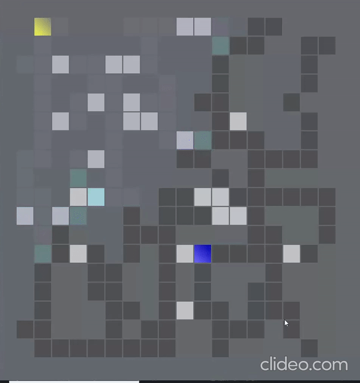

## Data Structures and Algirthims
This repo stores implementaitons for: Array-based lists (array queues, and deques), Linked Lists, Skip Lists, Hash Tables, Binary Trees, BSTS, Heaps, Trepes, ScapeGoat Trees, Red Black Trees. Contains course work to!   

Introductory data structures and algorithm courses are mainly focused on the trade offs of space and time costs assocaited with Remove(x), Find(x), Add(x) fundamental operations. Out of curiosoity, I fully implmented many additional data structures to improve my algoritmic thinking and become a better CS student. These include but are not limited  to: Trepes, ScapeGoat trees, Red-Black trees, SkipLists. 

All implementations are written Java. 

## Figures: A few examples of the content in this repo

###### Figure 1.1: Path finding via depth first approach

###### _Figure 2.1: AVL tree O(logn) amortized for rotations_ 

###### _Figure 3.1: HashTable based implementation of tictac toe game_ 

###### _Figure 4.1: Formal Definition of Asymptotic Notation, proving orders._

